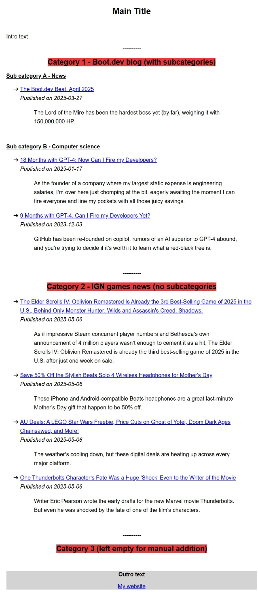

# Newsletter-from-rss

## Description

This tool automatically a periodic newsletter from RSS feeds

Here's an example :


You can add any number of categories, with or without sub-categories.  
For each, you can configure the max number of items and the max days interval of publication wanted.

A "app.log" file will be created/updated automatically each time you run the app.

## Why ?

I wrote this tool for friends that needed a quick way of generating a weekly newsletter for their association.
From the specific app I've build to them, I've make this customizable version.

## Installation

### Windows user
* Go to the "Releases" section on the right side of this GitHub page
* Download the Windows .zip file from the latest release
* Extract the .zip file to a location of your choice
* Configure the app (see below)
* Double click on newsletter_generator.exe to start generating your newsletter !
* Copy/paste the content of the created HTML file into your newsletter mail !

### Linux user
* Go to the "Releases" section on the right side of this GitHub page
* Download the Linux .tar.gz file from the latest release
* Extract with: `tar -xzf *filename*.tar.gz`
* Configure the app (see below)
* Run the application: `./newsletter_generator`
* Copy/paste the content of the created HTML file into your newsletter mail !

## Configuration

### Custom directory paths

By default, the app will use the executable directory (for Windows) or working directory (Linux) for template file, log file and output HTML file. 
If you want to define custom directory paths :
1. Create a file named ".env" in the same folder as the app file
2. Write one or all of these inside :
```
TEMPLATE_PATH=/path/for/template/directory/
OUTPUT_PATH=/path/for/output/
LOG_PATH=/path/for/log/directory/
```

### Template customization

If you want to customize the layout or styles of your newsletter, you can modify the *html_template.html* file.  
/!\ Be careful to not touch the "code" parts in it (marked with {{ }})

### Newsletter content
To set up the content of your newsletter, you'll need to edit the *config.json* file

#### Title, intro and outro
Simply modify the value of the fields below :

```json
{
    "main_title": "Main Title",
    "intro_text": "Intro text",
    "outro_text": "Outro text",
    "outro_link": "https://my.link",
    "outro_link_title": "My website",
}
```

#### Date format
You can specify which date format you want to be displayed by editing the *date_format* field.

For YYYY-MM-DD :
```json
{
    "date_format": "2006-01-02",
}
```

For DD-MM-YYYY :
```json
{
    "date_format": "02-01-2006",
}
```

#### Categories and sub-categories
The *categories* field is a list of categories, which can each have another list of sub-categories (based on the same model).  
The actual version only supports one level of sub-categories.

Here's some global explanation :

```json
{
    "title": "Category 1",                          
    // The category title, as displayed on top
    "rss_link": "https://blog.boot.dev/index.xml", 
    // The rss feed link. Only needed if no sub-categories
    "keyword": "",
    // The keyword for sub-categories based on keyword
    "days_interval": 30,
    // The maximum number of days in the past you want items to be in your newsletter (based on publication date). Leave to 0 if not needed.
    "max_items": 6,
    // The maximum number of items in the category (if no sub-categories). Leave to 0 if not needed.
    "subcategories": null
    // A list of sub-categories for this category. Leave to "null" if none.
}
```

##### Example 1- Category with subcategories based on keyword
Let's say you have a global rss feed for a website and want multiple sub-categories based on some keywords.  
Notice that app will look for those keywords in the "link" part of fetched items.
``` json
{
    "title": "Boot.dev blog",
    "rss_link": "",
    "keyword": "",
    "days_interval": 0,
    "max_items": 0,
    "subcategories": [
        {
            "title": "News",
            "rss_link": "https://blog.boot.dev/index.xml",
            "keyword": "news",
            "days_interval": 60,
            "max_items": 6,
            "subcategories": null
        },
        {
            "title": "Computer science",
            "rss_link": "https://blog.boot.dev/index.xml",
            "keyword": "computer-science",
            "days_interval": 0,
            "max_items": 2,
            "subcategories": null
        }
    ]
},
```
With this we'll have :
- The first 6 items with "news" in their link, with a publication date no more than 30 days ago, for the first sub-category 
- The first 2 items with "computer-science" in their link for the second sub-category

##### Example 2- Category with subcategories based on different RSS feed
This time we have a global category and one RSS feed for each sub-category.
``` json
{
    "title": "Videogame news",
    "rss_link": "",
    "keyword": "",
    "days_interval": 0,
    "max_items": 0,
    "subcategories": [
        {
            "title": "From IGN",
            "rss_link": "https://feeds.feedburner.com/ign/all",
            "keyword": "",
            "days_interval": 7,
            "max_items": 0,
            "subcategories": null
        },
        {
            "title": "From Games Informer",
            "rss_link": "https://gameinformer.com/news.xml",
            "keyword": "",
            "days_interval": 7,
            "max_items": 0,
            "subcategories": null
        }
    ]
},
```
With this we'll have:
- All items from IGN RSS feed of last week for the first sub-category 
-  All items from Game Informer RSS feed of last week for the second sub-category

#### Example 3- Category with no sub-categories
We just want a main category directly with links in it.

```json
{
    "title": "Tech news",
    "rss_link": "https://www.theverge.com/rss/partner/subscriber-only-full-feed/rss.xml",
    "keyword": "",
    "days_interval": 0,
    "max_items": 10,
    "subcategories": null
},
```
With this we'll have:
- A global category with the last 10 items from the given RSS Feed

#### Example 4- Empty category
You can also let an empty category to manually add content later
```json
{
    "title": "Mark your calendars",
    "rss_link": "",
    "keyword": "",
    "days_interval": 0,
    "max_items": 0,
    "subcategories": null
},
```

## Contributing

### Clone the repo

```shell
git clone https://github.com/VincNT21/newsletter-from-rss
```

### Install Go

```shell
sudo apt install golang
```

### Check for dependencies

```shell
go mod tidy
```

### Run the app

```shell
go run .
```

### Submit a pull request
If you'd like to contribute, please fork the repository and open a pull request to the main branch.